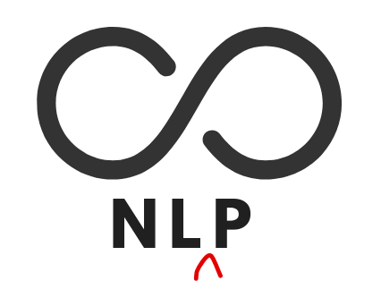

# NLOOP
_Documents are objects, so let's treat them as such..._


**NLOOP** is a python package that provides a convenient interface for
 processing, analyzing, and modeling text data using popular natural language
  processing libraries such as [spaCy](https://spacy.io/), [gensim](https://radimrehurek.com/gensim/), and sometimes [NLTK](http://www.nltk.org/)! 

Install NLOOP by running the following in the command line:

```bash
git clone https://github.com/syasini/NLOOP.git

cd NLOOP

pip install [-e] .
```

_NOTE_: Don't forget the `.` at the end! 
The `-e` argument will install the package in editable mode which is suitable
 for developement. Since currently the code is being regularly updated
 , using this option is recommended. 

_(optional)_

If you use conda, consider creating a new environment prior to the previous steps to ensure a clean installation of NLOOP:

```bash
conda create -n nloop_env python=3.7

conda activate nloop_env
```

## Quick Start

```python
import os
import pandas as pd
import numpy as np

from nloop import Text
```

Let's create a corpus with 3 documents.
```python
>>> docs = ["This is my first document.", "And here's another boring one.", "And
 let's add a third one just in case!"]
```

Create a `Text` object with `docs`
```python
>>> text = Text(docs, fast=False)

spacy_model: "en"
Only keeping: ['ADJ', 'NOUN', 'PROPN', 'VERB']
nlp.pipe_names = ['tagger', 'parser', 'ner', 'textrank']
```

Access the processed document using `.doc`.
```python
>>> text.docs

[This is my first document., 
And here's another boring one., 
And let's add a third one just in case!]
```

Each element is a spacy `Doc` object, so we have a list of lists here. The first
 index refers to each document, and the second index to the tokens within
  that document. For example to see the first document we can use

```python
>>> text.docs[0]

This is my first document.
```

And to see the first token in the first document use 
```python
>>> text.docs[0][0]

This
```

The raw tokens can are collectively assembled in 
```python
>>> text.raw_tokens

[[This, is, my, first, document, .],
 [And, here, 's, another, boring, one, .],
 [And, let, 's, add, a, third, one, just, in, case, !]]
```

The clean and processed token are saved in `.tokens`. 
```python 
>>> text.tokens

[['document'], 
 ['boring'], 
 ['let', 'add', 'case']]
```

The elements are just strings
 and not spacy Tokens. These are basically the `.lemma_`s of the `raw_tokens
 `, excluding any stop words and parts of speech other than `['ADJ', 'NOUN
 ', 'PROPN', 'VERB']` which was indicated upon instantiation of text. 
 
 The bag of words (bow) and TFiDF vectors are also calculated and stored in 
 
 ```python
>>> text.corpus_bow

[[(0, 1)], 
 [(1, 1)], 
 [(2, 1), (3, 1), (4, 1)]]
```

and 

```python
>>>text.corpus_tfidf

[[(0, 1.0)],
 [(1, 1.0)],
 [(2, 0.577350), (3, 0.577350), (4, 0.577350)]]
```

Other thing to try:
 `text.dictionary` 
 `text.token_counter`
  `text.word_cloud()`
  `text.keywords`
  `text.sentences`
  `text.docs.noun_chunks`
  ... 